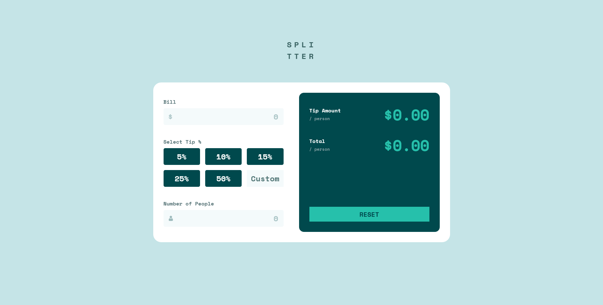
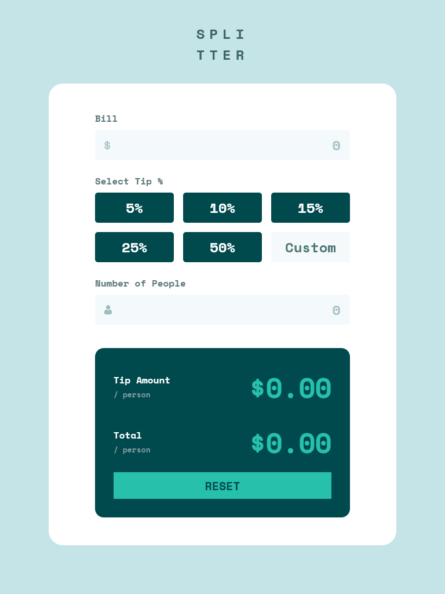
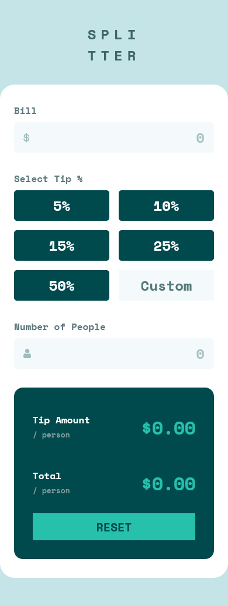

# Frontend Mentor - Tip calculator app solution

This is a solution to the [Tip calculator app challenge on Frontend Mentor](https://www.frontendmentor.io/challenges/tip-calculator-app-ugJNGbJUX). Frontend Mentor challenges help you improve your coding skills by building realistic projects.

## Table of contents

- [Overview](#overview)
  - [The challenge](#the-challenge)
  - [Screenshot](#screenshot)
  - [Links](#links)
- [My process](#my-process)
  - [Built with](#built-with)
  - [What I learned](#what-i-learned)
  - [Continued development](#continued-development)
  - [Useful resources](#useful-resources)
- [Author](#author)
- [Acknowledgments](#acknowledgments)

## Overview

### The challenge

Users should be able to:

- View the optimal layout for the app depending on their device's screen size
- See hover states for all interactive elements on the page
- Calculate the correct tip and total cost of the bill per person

### Screenshot

#### Desktop

#### Tablet

#### Mobile

### Links

- Solution URL: [https://github.com/PetarR21/tip-calculator-app](https://github.com/PetarR21/tip-calculator-app)
- Live Site URL: [https://tip-calculator-app-tau-murex.vercel.app/](https://tip-calculator-app-tau-murex.vercel.app/)

## My process

### Built with

- Semantic HTML5 markup
- CSS custom properties
- Flexbox
- CSS Grid
- [React](https://reactjs.org/) - JS library

### What I learned

I learned how to create custom inputs, like text input with dollar sign or profile icon. Also I learned how to create custom buttons used to select the tip percentage. I also learned how to use React useState and useEffect to manage form inputs and calculations. Also I used React to control the state of the inputs, and to handle the errors based on the wide range of user inputs.

### Continued development

I would like to continue improving my skills, especially in managing state and handling forms more effectively. I also want to explore more advanced CSS techniques for styling and layout.

Also, I would like to improve my code in the future so it is more clean and simple. I would like to use more reusable components and hooks in React, and to make the code more modular.

### Useful resources

- [Number-only inputs aren't so straight-forward](https://www.youtube.com/shorts/nnZS761ngXE) - This helped me style my text inputs.
- [https://stackoverflow.com/questions/2913236/html-text-input-field-with-currency-symbol](https://stackoverflow.com/questions/2913236/html-text-input-field-with-currency-symbol) - This helped me with creating a custom input, with icon on the left side, and text input on the right side.

## Author

- Frontend Mentor - [@PetarR21](https://www.frontendmentor.io/profile/PetarR21)

## Acknowledgments

Big thanks to amazing FrontendMentor Discord community.
